# ConsoleCarRental

A console based application that allows you to enter cars and motorcycles into the system and have the systems state persist between application executions.

---

## Features

- Add vehicle (Car or Motorcycle)
- Search vehicle by ID
- Display all vehicles
- Display available vehicles only
- Rent vehicle
- Return vehicle
- Persists application state between program runs

---

## Project Structure

```
project-root/
│
├── build/                     # Build output (ignored)
├── inc/                       # Header files
├── Scripts/                   # Helper scripts (e.g., build automation)
├── src/                       # Source files
|
├── .gitignore                 # Files and folders excluded from version control
├── CMakeLists.txt             # CMake build configuration
├── CMakePresets.json          # Optional CMake configuration presets
├── Cos2614_Assignment_1.pdf   # Assingment pdf
├── LICENSE.md                 # Project license
├── main.cpp                   # Application entry point
└── README.md                  # Project documentation
```

---

## Getting Started

### Requirements

Ensure the following are installed:

- [ ] C++ compiler (GCC, Clang, MSVC, etc)
- [ ] Qt 6.11.1 for specific toolchain you installed
- [ ] CMake (3.16+ recommended)
- [ ] Ninja (Any build executor that CMake supports is fine)

### Option 1: Using Qt Creator (Recommended)

Uncompress the project

1. Open Qt Creator
2. Click ```File```
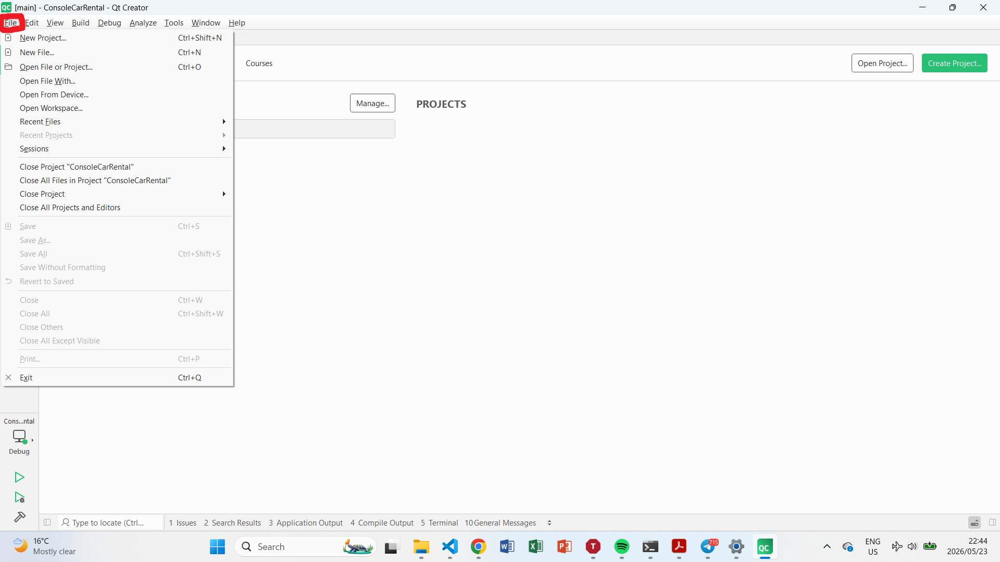
3. Click ```Open File or Project```
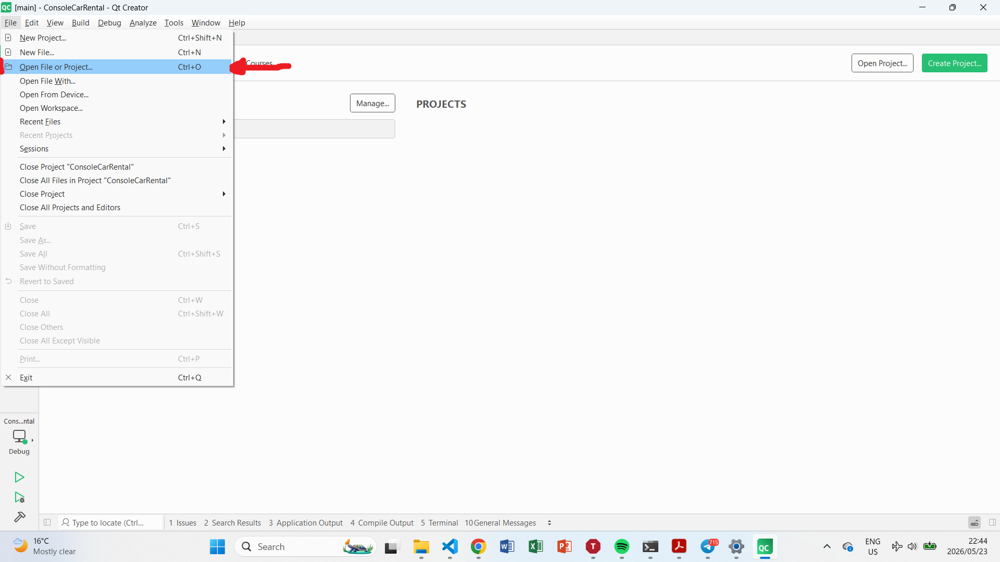
4. Open the project's ```CMakeLists.txt``` file in the project root directory
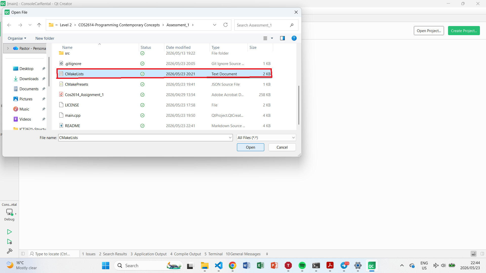
5. Click on ```Projects```
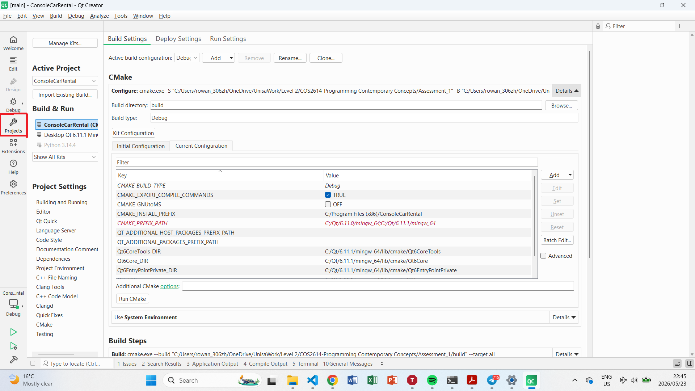
6. In **Build & Run**, click on ```ConsoleCarRental```
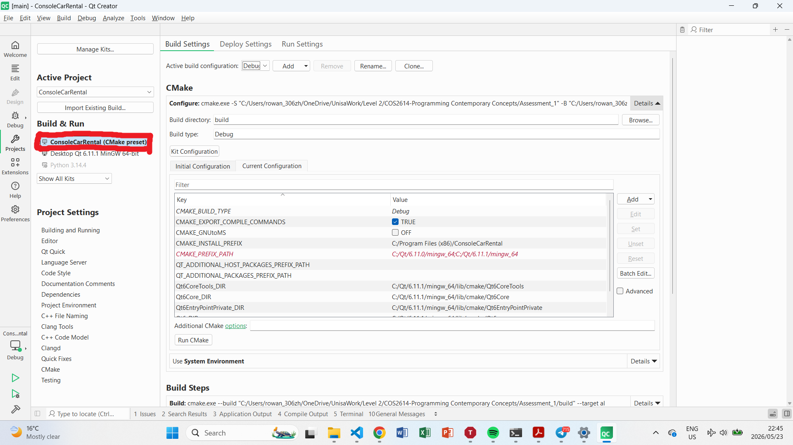
7. Click on ```Building and Running```
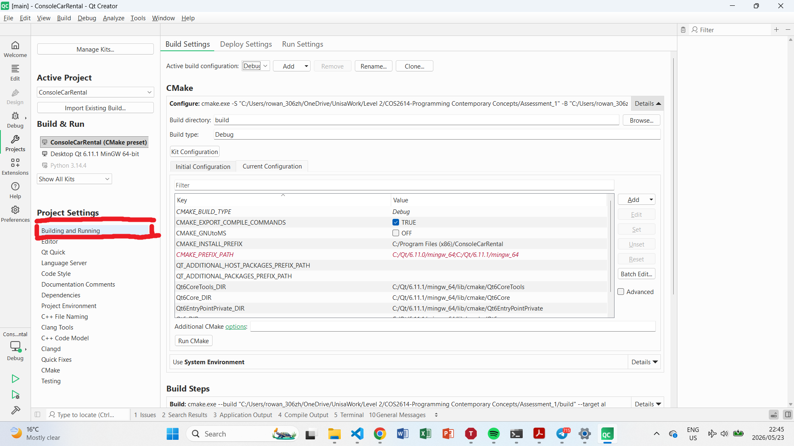
8. Enable the setting **Default for "Run in terminal"** otherwise console input/output will not work
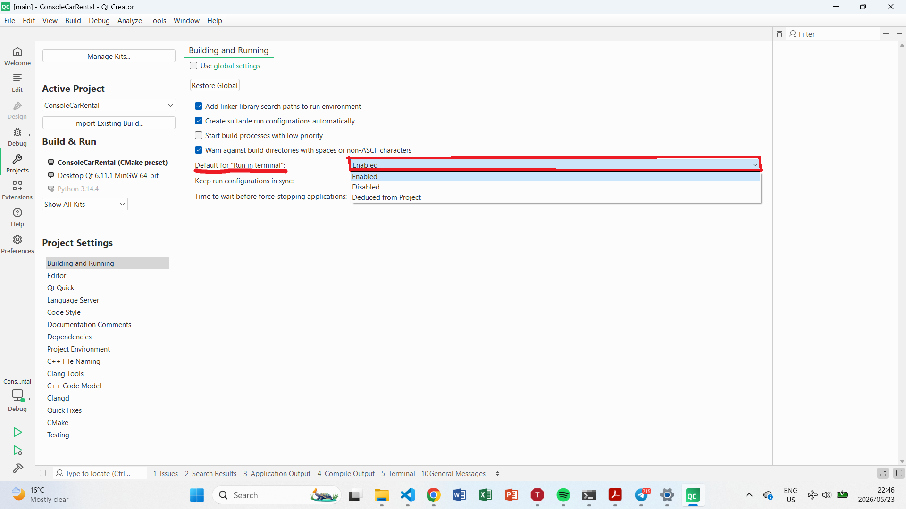
9. Navigate back to the project in Qt Creator
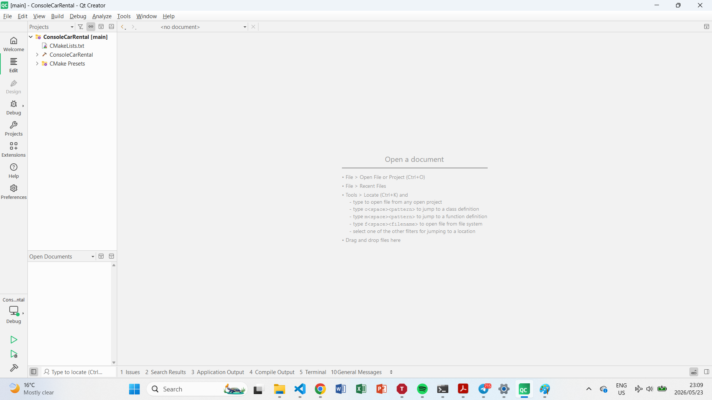
10. Build the project
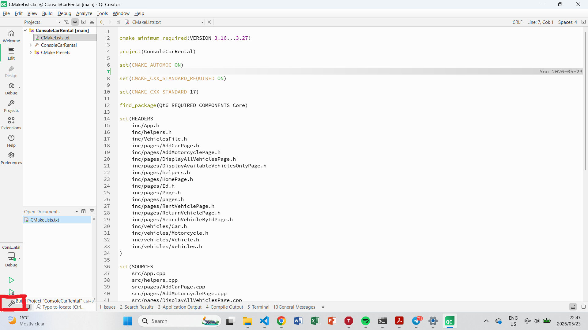
11. Run the project
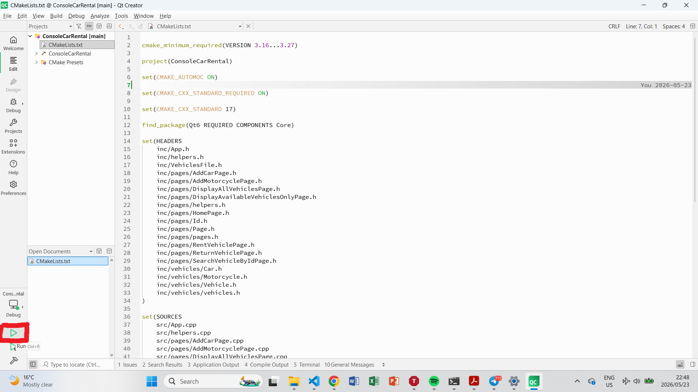
12. The applicaton should now be running in the Qt Creator terminal
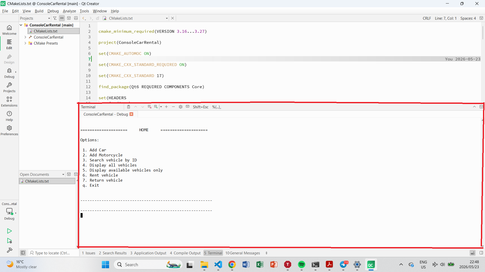

### Option 2: Build from Terminal (CMake):

1. Traverse to your project root:
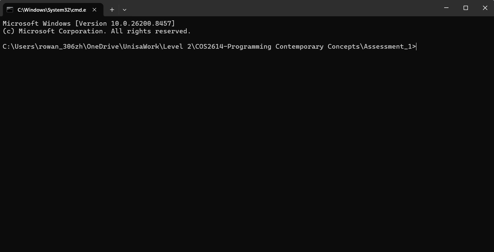

2. Generate Build Files
```
cmake -S . -B build -G "Build tool name" -DCMAKE_MAKE_PROGRAM="C:\Path\to\build\executor\program.executable_binary" -DCMAKE_C_COMPILER="C:\Path\to\toolchain's\C\compiler.executable_binary" -DCMAKE_CXX_COMPILER="C:\Path\to\toolchain's\C++\compiler.executable_binary" -DCMAKE_PREFIX_PATH="C:\Path\to\Qt\toolChainUsed"
```

For example, Mine for Windows operating system with mingw64 toolchain is:

```
cmake -S . -B build ^
-G "Ninja" ^
-DCMAKE_MAKE_PROGRAM="C:\ninja\ninja.exe" ^
-DCMAKE_C_COMPILER="C:\msys64\mingw64\bin\gcc.exe" ^
-DCMAKE_CXX_COMPILER="C:\msys64\mingw64\bin\g++.exe" ^
-DCMAKE_PREFIX_PATH="C:\Qt\6.11.1\mingw_64"
```
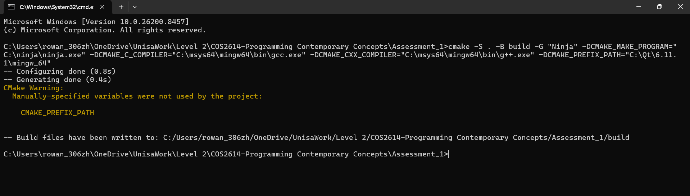

3. Build the Project
```
cmake --build build
```
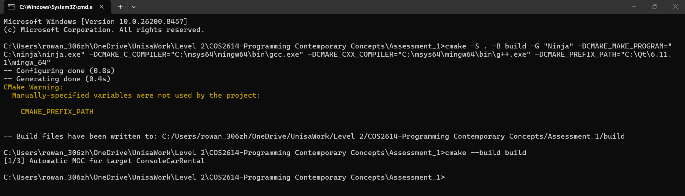

4. Run the Application
```
cd build
```
```
ConsoleCarRental.exe
```
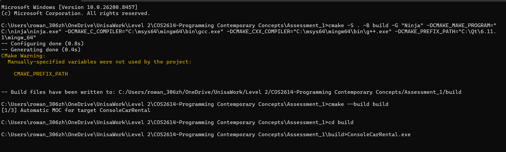

The application should now be running in the terminal
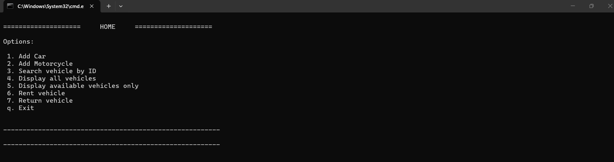

---

## Notes
- Data is loaded on startup and saved during runtime.
- File paths are relative to the application working directory.
- The application may run or not
